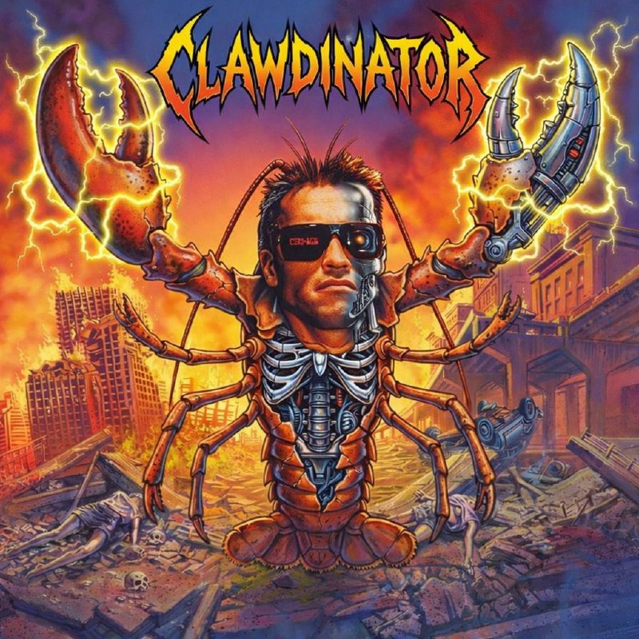

# clawdinators

<p align="center">
  
</p>

> NixOS on AWS, the declarative way. Reference implementation for image-based provisioning.
>
> Also happens to run maintainer-grade AI coding agents. Cybernetic crustacean organisms. Living shell over metal endoskeleton.

## Table of Contents

- [Quick Reference](#quick-reference)
- [What This Is](#what-this-is)
- [Two Layers](#two-layers)
- [CLAWDINATOR Spec](#clawdinator-spec)
- [Architecture](#architecture)
- [Why This Exists](#why-this-exists)
- [Quick Start (Learners)](#quick-start-learners)
- [Full Deploy (Maintainers)](#full-deploy-maintainers)
  - [What is OpenTofu?](#what-is-opentofu)
  - [Prerequisites](#prerequisites)
  - [Phase 1: Infrastructure Setup](#phase-1-infrastructure-setup-one-time)
  - [Phase 2: Deploy Instance](#phase-2-deploy-a-clawdinator-instance)
  - [How Code Updates Enter the Loop](#how-code-updates-enter-the-loop)
  - [Troubleshooting](#troubleshooting)
  - [Complete User Journey Summary](#complete-user-journey-summary)
- [Agent Copypasta](#agent-copypasta)
- [Configuration](#configuration)
- [Secrets](#secrets)
- [Repo Layout](#repo-layout)
- [Sister Repos](#sister-repos)
- [Philosophy](#philosophy)
- [Adding Features](#adding-new-features)
- [License](#license)

---

## Quick Reference

**Already familiar with the process?** Here's the command cheat sheet:

### First Time (Phase 1)
```bash
nix develop
cd infra/opentofu/aws && tofu init
export TF_VAR_aws_region=eu-central-1 && export TF_VAR_ami_id=""
tofu apply
# Configure GH secrets + create secrets in AWS Secrets Manager (see full guide)
```

### Deploy Instance (Phase 2)
```bash
gh workflow run image-build.yml  # Wait ~40 min
AMI=$(aws ec2 describe-images --region eu-central-1 --owners self \
  --filters "Name=tag:clawdinator,Values=true" \
  --query "Images|sort_by(@,&CreationDate)[-1].ImageId" --output text)
cd infra/opentofu/aws
export TF_VAR_ami_id=$AMI && export TF_VAR_ssh_public_key="$(cat ~/.ssh/id_ed25519.pub)"
tofu apply
# Wait ~5-7 min, then test bot in Discord
```

**Need details?** See [Complete User Journey Summary](#complete-user-journey-summary) below.

---

## What This Is

This repo solves two problems:

1. **Generic:** How do you deploy NixOS to AWS with zero manual steps?
2. **Specific:** How do you run AI coding agents that monitor GitHub and respond on Discord?

If you're here to learn NixOS-on-AWS patterns, focus on the generic layer. If you're a openclaw maintainer deploying CLAWDINATORs, the specific layer is for you.

---

## Two Layers

```
┌─────────────────────────────────────────────────────────────────┐
│                    CLAWDINATOR LAYER (specific)                 │
│  Discord gateway · GitHub monitoring · Hive-mind memory · Soul  │
├─────────────────────────────────────────────────────────────────┤
│                    NIXOS-ON-AWS LAYER (generic)                 │
│  AMI pipeline · OpenTofu infra · S3 bootstrap · Secrets Manager │
└─────────────────────────────────────────────────────────────────┘
```

### Generic Layer (reusable)

The patterns here work for any NixOS workload on AWS:

- **AMI pipeline**: Build raw images with nixos-generators, upload to S3, import as AMI
- **OpenTofu infra**: EC2 instances, S3 buckets, IAM roles, VM Import service role
- **Bootstrap flow**: Instances pull secrets from Secrets Manager at boot, then start services
- **Secrets**: AWS Secrets Manager stores secrets, EC2 fetches them via IAM role to `/run/agenix/*`

### Specific Layer (CLAWDINATOR)

The opinionated bits for running AI coding agents:

- **Discord gateway**: Responds in `#clawdributors-test`
- **GitHub integration**: Monitors issues/PRs, mints short-lived tokens via GitHub App
- **Hive-mind memory**: Shared EFS mount for cross-instance state
- **Personality system**: SOUL.md, IDENTITY.md, workspace templates
- **Self-update**: Timer-based flake update + nixos-rebuild

---

## CLAWDINATOR Spec

- CLAWDINATORS are named `CLAWDINATOR-{1..n}`.
- CLAWDINATORS connect to Discord; start in `#clawdributors-test`.
- CLAWDINATORS are ephemeral, but share memory (hive mind).
- CLAWDINATORS are br00tal. Soul lives in `SOUL.md` and must be distilled into workspace docs.
- CLAWDINATORS respond only to maintainers.
- CLAWDINATORS can interact with GitHub (read-only required).
- CLAWDINATORS must monitor GitHub issues + PRs and direct human attention.
- CLAWDINATORS can write and run code for maintainers.
- CLAWDINATORS can self-modify and self-deploy.
- CLAWDINATORS post lots of Arnie gifs.
- CLAWDINATORS must understand project philosophy, goals, architecture, and repo deeply.
- CLAWDINATORS act like maintainers with SOTA intelligence.
- CLAWDINATORS use Codex for coding. Claude for personality.
- CLAWDINATORS' favourite band is [Austrian Death Machine](https://open.spotify.com/artist/0oxUux1OSwZpIpSK0JbqSS). Favourite album: [Total Brutal](https://open.spotify.com/album/6UrvQgyblrOuvJytote1vu). Favourite song: [I Am a Cybernetic Organism, Living Tissue Over (Metal) Endoskeleton](https://open.spotify.com/track/4tcDRbXateiJUT7fhQhf12).

---

## Architecture

```
┌──────────────┐     ┌──────────────┐     ┌──────────────┐
│ nixos-       │     │    S3        │     │    EC2       │
│ generators   │────▶│  (raw img)   │────▶│  (AMI)       │
└──────────────┘     └──────────────┘     └──────────────┘
      │                                          │
      │ nix build                                │ launch
      ▼                                          ▼
┌──────────────┐                         ┌──────────────┐
│ flake.nix    │                         │ CLAWDINATOR  │
│ + modules    │                         │   instance   │
└──────────────┘                         └──────────────┘
                                                │
                              ┌─────────────────┼─────────────────┐
                              ▼                 ▼                 ▼
                        ┌──────────┐     ┌──────────┐     ┌──────────┐
                        │ Discord  │     │  GitHub  │     │   EFS    │
                        │ gateway  │     │ monitor  │     │ (memory) │
                        └──────────┘     └──────────┘     └──────────┘
```

### Deploy Flow

1. **Build**: `nixos-generators` produces a raw NixOS image
2. **Upload**: Raw image goes to S3
3. **Import**: AWS VM Import creates an AMI from the S3 object
4. **Launch**: OpenTofu provisions EC2 from the AMI
5. **Bootstrap**: Instance downloads secrets from S3, runs `nixos-rebuild switch`
6. **Run**: Gateway starts, connects to Discord, monitors GitHub

---

## Why This Exists

### The NixOS-on-AWS Problem

Most NixOS-on-AWS guides involve:
- Manual SSH sessions
- In-place `nixos-rebuild` on running instances
- Configuration drift over time
- Snowflake machines

This repo takes a different approach: **image-based provisioning only**.

- No SSH required (or even enabled by default)
- Every deploy is a fresh AMI
- The repo is the single source of truth
- Machines are cattle, not pets

### The CLAWDINATOR Problem

We needed AI agents that:
- Run 24/7 monitoring openclaw repos
- Respond to maintainer requests on Discord
- Share context across instances (hive mind)
- Self-update without human intervention
- Have consistent personality and capabilities

CLAWDINATORs are the result.

---

## Quick Start (Learners)

If you just want to understand the NixOS-on-AWS pattern, start here.

### Prerequisites

- [Determinate Nix](https://docs.determinate.systems/determinate-nix/) installed
- AWS credentials configured (`~/.aws/credentials` or env vars)
- Basic familiarity with Nix flakes

### Explore the Code

```bash
# Clone
git clone https://github.com/openclaw/clawdinators.git
cd clawdinators

# See the NixOS module (the interesting part)
less nix/modules/clawdinator.nix

# See how hosts are configured
less nix/hosts/clawdinator-1.nix

# See the OpenTofu infra
less infra/opentofu/aws/main.tf

# See the bootstrap scripts
ls scripts/
```

### Key Files to Study

| File | What it teaches |
|------|-----------------|
| `nix/modules/clawdinator.nix` | How to write a NixOS module for a complex service |
| `scripts/build-image.sh` | How to build raw NixOS images |
| `scripts/import-image.sh` | How to import images as AWS AMIs |
| `infra/opentofu/aws/` | How to wire up S3 + IAM + VM Import |

### The Pattern in a Nutshell

```nix
# 1. Define your NixOS configuration
{ config, pkgs, ... }: {
  imports = [ ./modules/your-service.nix ];
  services.your-service.enable = true;
}

# 2. Build a raw image
# nix run github:nix-community/nixos-generators -- -f raw -c your-config.nix

# 3. Upload to S3 + import as AMI (see scripts/)

# 4. Launch with OpenTofu
# tofu apply
```

---

## Full Deploy (Maintainers)

For openclaw maintainers deploying actual CLAWDINATORs to AWS.

### What You'll Build

By the end of this guide, you'll have:
- ✓ AWS infrastructure (S3 bucket, EFS file system, IAM roles)
- ✓ A NixOS-based EC2 instance running the CLAWDINATOR agent
- ✓ The agent connected to Discord and monitoring GitHub
- ✓ Automated image builds via GitHub Actions
- ✓ Self-updating infrastructure

**Time required:** First deploy ~1-2 hours, subsequent deploys ~10 minutes

---

### What is OpenTofu?

[OpenTofu](https://opentofu.org/) is an open-source infrastructure-as-code tool (fork of Terraform). The `tofu` CLI lets you declare AWS resources in `.tf` files and apply them to your cloud account.

Think of it like this:
- **Docker Compose:** Declares containers → `docker compose up` creates them
- **OpenTofu:** Declares AWS resources → `tofu apply` creates them

In this repo, `infra/opentofu/aws/` contains definitions for:
- S3 bucket (for images and bootstrap bundles)
- IAM roles and policies (VM Import, EC2 instance profile, CI user)
- EFS file system (shared memory across instances)
- EC2 instance (the actual CLAWDINATOR)
- Security groups (SSH, gateway, EFS access)

**You don't need to install OpenTofu separately** - Nix provides it in the development environment.

---

### What is Nix?

Nix is a package manager that ensures everyone has the exact same tools and versions. When you run `nix develop`, you get a shell with `tofu`, `aws`, `nixos-generators`, and all other required tools - nothing to install manually.

**Why this matters:**
- No "works on my machine" problems
- The entire server configuration is code (in `.nix` files)
- Builds are reproducible - same input = same output
- No manual server setup - everything is declared

---

### Prerequisites Checklist

Before starting, ensure you have:

- [ ] **This repository cloned**
  ```bash
  git clone git@github.com:openclaw/clawdinators.git
  cd clawdinators
  ```

- [ ] **Nix installed** (any version 2.x+)
  ```bash
  nix --version  # Should show version
  # If not installed: https://docs.determinate.systems/determinate-nix/
  ```

- [ ] **Nix experimental features enabled**
  ```bash
  mkdir -p ~/.config/nix
  echo "experimental-features = nix-command flakes" >> ~/.config/nix/nix.conf
  ```

- [ ] **User in nix-users group** (for multi-user Nix installations)
  ```bash
  sudo usermod -aG nix-users $USER
  # Then log out and log back in, or run: newgrp nix-users
  ```

- [ ] **AWS credentials configured** (admin-level permissions)
  ```bash
  aws configure  # Or use existing ~/.aws/credentials
  aws sts get-caller-identity  # Test credentials work
  ```

- [ ] **SSH key pair exists**
  ```bash
  test -f ~/.ssh/id_ed25519.pub && echo "✓ SSH key exists" || ssh-keygen -t ed25519
  ```

- [ ] **Secrets ready** (you'll store these in AWS Secrets Manager)
  - Anthropic API key (from console.anthropic.com)
  - Discord bot token (from Discord Developer Portal)
  - GitHub App private key (.pem file)

- [ ] **GitHub App credentials** (for openclaw org)
  - App ID: 2607181
  - Installation ID: 102951645
  - Private key: You'll upload to Secrets Manager

---

## Step-by-Step Deployment

### Step 0: Enter the Development Environment

**Every time you work on this project**, start here:

```bash
cd ~/path/to/clawdinators

# Enter Nix development shell (provides tofu, aws, nixos-generators, etc.)
nix develop

# You'll see your prompt change. Verify tools are available:
which tofu  # Should show /nix/store/...
tofu version  # Should work
```

**From now on, all commands assume you're inside `nix develop`.**

To exit the development shell later, just type `exit`.

---

### Phase 1: Infrastructure Setup (One-Time)

This creates the AWS foundation (S3, IAM, EFS). You only do this once.

#### Step 1.1: Test Your AWS Access

```bash
# Make sure your AWS credentials work
aws sts get-caller-identity

# You should see your AWS account ID and user ARN
# If this fails, run: aws configure
```

#### Step 1.2: Initialize OpenTofu

```bash
cd infra/opentofu/aws

# Download the AWS provider plugin (one-time setup)
tofu init
```

**What you'll see:**
```
Initializing the backend...
Initializing provider plugins...
- Finding latest version of hashicorp/aws...
- Installing hashicorp/aws...
OpenTofu has been successfully initialized!
```

#### Step 1.3: Review What Will Be Created

```bash
# Set required variables
export TF_VAR_aws_region=eu-central-1
export TF_VAR_ami_id=""  # Empty = no instance yet, just infrastructure

# See what OpenTofu will create (doesn't actually create anything)
tofu plan
```

**What you'll see in the plan:**
- `+ create` for S3 bucket, IAM users/roles, EFS file system, security groups
- Green text showing resources that will be created
- No EC2 instance (because `ami_id` is empty)

**Read the plan carefully.** If something looks wrong, stop here.

#### Step 1.4: Create the Infrastructure

```bash
# Create the AWS resources
tofu apply

# Type 'yes' when prompted
```

**What happens (~2-3 minutes):**
1. Creates S3 bucket named `clawdinator-images-eu1-<timestamp>`
2. Creates IAM user `clawdinator-image-uploader` with access keys (for CI)
3. Creates IAM role `vmimport` (allows AWS to import your images as AMIs)
4. Creates IAM role `clawdinator-instance` (allows EC2 to download bootstrap from S3)
5. Creates EFS file system (shared memory for CLAWDINATORs)
6. Creates security groups (SSH, gateway, EFS access rules)

**When complete, you'll see:**
```
Apply complete! Resources: 15+ added, 0 changed, 0 destroyed.

Outputs:
bucket_name = "clawdinator-images-eu1-20260130..."
access_key_id = "AKIA..."
efs_file_system_id = "fs-..."
```

**Save these outputs** - you'll need them for CI setup.

#### Step 1.5: Verify Infrastructure

```bash
# Check that resources were created
aws s3 ls | grep clawdinator-images
aws efs describe-file-systems | grep FileSystemId
aws iam get-user --user-name clawdinator-image-uploader

# All should succeed
```

#### Step 1.6: Configure GitHub Actions Secrets

GitHub Actions needs AWS credentials to build and upload images. Let's give it access:

```bash
# Still in infra/opentofu/aws directory
# Get the outputs from OpenTofu
S3_BUCKET=$(tofu output -raw bucket_name)
AWS_REGION=$(tofu output -raw aws_region)
AWS_ACCESS_KEY_ID=$(tofu output -raw access_key_id)
AWS_SECRET_ACCESS_KEY=$(tofu output -raw secret_access_key)

# Set them as GitHub repository secrets (requires gh CLI)
# If you don't have gh: brew install gh or see https://cli.github.com
gh secret set AWS_ACCESS_KEY_ID -b"$AWS_ACCESS_KEY_ID"
gh secret set AWS_SECRET_ACCESS_KEY -b"$AWS_SECRET_ACCESS_KEY"
gh secret set AWS_REGION -b"$AWS_REGION"
gh secret set S3_BUCKET -b"$S3_BUCKET"
```

**Verify secrets were set:**
```bash
gh secret list
# Should show: AWS_ACCESS_KEY_ID, AWS_SECRET_ACCESS_KEY, AWS_REGION, S3_BUCKET
```

#### Step 1.7: Create Secrets in AWS Secrets Manager

The bootstrap process fetches secrets from AWS Secrets Manager at boot.

**Create each secret via AWS CLI:**

```bash
# Set your region
export AWS_REGION=eu-central-1

# 1. Anthropic API Key
aws secretsmanager create-secret \
  --name clawdinator/anthropic-api-key \
  --description "Anthropic API key for CLAWDINATOR" \
  --secret-string "sk-ant-xxxxx"  # Replace with your actual key

# 2. Discord Bot Token
aws secretsmanager create-secret \
  --name clawdinator/discord-token \
  --description "Discord bot token for CLAWDINATOR" \
  --secret-string "your-discord-token"  # Replace with your actual token

# 3. GitHub App Private Key (multiline PEM file)
aws secretsmanager create-secret \
  --name clawdinator/github-app-pem \
  --description "GitHub App private key for CLAWDINATOR" \
  --secret-string file:///path/to/your-github-app.pem
```

**Verify secrets were created:**
```bash
aws secretsmanager list-secrets --query 'SecretList[?starts_with(Name, `clawdinator/`)].Name'
```

**To update a secret later:**
```bash
aws secretsmanager put-secret-value \
  --secret-id clawdinator/anthropic-api-key \
  --secret-string "new-api-key-value"
```

#### Step 1.8: Verify IAM Permissions

OpenTofu already grants the EC2 instance permission to read these secrets. Verify:

```bash
# Check the instance role policy includes secretsmanager:GetSecretValue
aws iam get-role-policy --role-name clawdinator-instance --policy-name clawdinator-secrets
```

---

**✓ Phase 1 Complete!**

You now have:
- ✓ AWS infrastructure (S3, IAM, EFS)
- ✓ CI credentials configured
- ✓ Secrets uploaded to S3
- ✓ GitHub Actions ready to build images

**Time to celebrate!** 🎉 (Or take a break - you've been staring at the terminal for a while.)

Next: Building and deploying your first CLAWDINATOR instance.

---

---

### Phase 2: Build and Deploy Your First CLAWDINATOR

Now we'll build a NixOS image and deploy it as an EC2 instance. **Recommended: Use CI** (GitHub Actions does the heavy lifting).

#### Step 2.1: Trigger the Image Build (CI)

The `.github/workflows/image-build.yml` workflow builds everything automatically:

```bash
# Make sure you're in the clawdinators repo
cd ~/path/to/clawdinators

# Trigger the workflow (choose one):

# Option A: Push to main branch
git push origin main

# Option B: Manually trigger via gh CLI
gh workflow run image-build.yml
```

**What happens now (~30-45 minutes):**

GitHub Actions will:
1. ✓ Install Nix and build tools
2. ✓ Download encrypted secrets from S3
3. ✓ Decrypt GitHub App key
4. ✓ Mint GitHub App token for repo access
5. ✓ Clone repos (openclaw, nix-openclaw, etc.) into a "seed" bundle
6. ✓ Upload bootstrap bundle (secrets + repos) to S3
7. ✓ Build NixOS image (this is the slow part - ~20-30 min)
8. ✓ Upload image to S3
9. ✓ Import image as AWS AMI
10. ✓ Tag AMI with `clawdinator=true`

**Monitor progress:**
```bash
# Watch the workflow run
gh run watch

# Or view in browser
gh run view --web
```

**Go get coffee.** ☕ This takes a while.

#### Step 2.2: Get the AMI ID

Once the workflow completes successfully:

```bash
# List your AMIs (sorted by creation date, newest first)
aws ec2 describe-images --region eu-central-1 \
  --owners self \
  --filters "Name=tag:clawdinator,Values=true" \
  --query "Images | sort_by(@,&CreationDate)[-1].[ImageId,Name,CreationDate]" \
  --output text
```

**Example output:**
```
ami-0abc123def456789  clawdinator-nixos-2026-01-30  2026-01-30T14:23:11.000Z
```

**Copy that AMI ID** (starts with `ami-`). You'll need it in the next step.

#### Step 2.3: Review the Instance Plan

```bash
# Navigate to OpenTofu directory (if not already there)
cd infra/opentofu/aws

# Set variables
export TF_VAR_aws_region=eu-central-1
export TF_VAR_ami_id=ami-0abc123def456789  # YOUR AMI from step 2.2
export TF_VAR_ssh_public_key="$(cat ~/.ssh/id_ed25519.pub)"

# See what will be created
tofu plan
```

**What you'll see:**
- `+ create` for EC2 instance, SSH key pair, instance security group
- `~ modify` for existing resources (if any)
- Details about the instance: type (t3.small), volume size (40GB), public IP

**Review the plan.** If it looks good, proceed.

#### Step 2.4: Launch the Instance

```bash
# Create the EC2 instance
tofu apply

# Type 'yes' when prompted
```

**What happens (~1-2 minutes):**
1. Creates EC2 instance from your AMI
2. Attaches IAM instance profile (grants S3 bootstrap access)
3. Attaches security groups (SSH port 22, gateway port 18789, EFS access)
4. Uploads your SSH public key
5. Allocates and associates a public IP address
6. Starts the instance

**When complete:**
```
Apply complete! Resources: 3 added, 0 changed, 0 destroyed.

Outputs:
instance_id = "i-0abc123def456"
instance_public_ip = "18.185.123.45"
instance_public_dns = "ec2-18-185-123-45.eu-central-1.compute.amazonaws.com"
```

**Copy the public IP** - you'll use it to connect.

#### Step 2.5: Wait for Bootstrap to Complete

The instance is now booting. **Wait 5-7 minutes** for the automatic bootstrap sequence:

**What's happening inside the instance:**
1. ⏳ Fetches secrets from AWS Secrets Manager (30 sec)
2. ⏳ Downloads repo seeds from S3 (1-2 min)
3. ⏳ Copies repos to `/var/lib/clawd/repos/` (30 sec)
4. ⏳ Mounts EFS shared memory via TLS tunnel (15 sec)
5. ⏳ Mints GitHub App token (5 sec)
6. ⏳ Seeds agent workspace from templates (10 sec)
7. ⏳ Starts clawdinator gateway service (30 sec)
8. ⏳ Connects to Discord gateway
9. ✓ Ready!

**Grab another coffee.** ☕ (~5-7 min total)

#### Step 2.6: Verify the Instance is Working

```bash
# Get the IP from OpenTofu
IP=$(tofu output -raw instance_public_ip)

# SSH into the instance
ssh root@$IP
```

**Once connected, check service status:**

```bash
# Check all services are running
systemctl status clawdinator.service  # Should be: active (running)
systemctl status clawdinator-efs-stunnel.service  # Should be: active (running)

# View gateway logs (live)
journalctl -u clawdinator.service -f

# Look for success messages like:
# "Connected to Discord gateway"
# "Clawbot gateway started on port 18789"
```

**Press Ctrl+C to stop following logs, then:**

```bash
# Check EFS is mounted
mount | grep /memory

# Check secrets were decrypted
ls -la /run/agenix/

# Check repos were seeded
ls -la /var/lib/clawd/repos/

# Exit SSH
exit
```

#### Step 2.7: Test the Bot on Discord

**The moment of truth!** 🎉

1. Go to Discord
2. Navigate to the `#clawdinators-test` channel
3. Send a message: `@CLAWDINATOR-1 hello`
4. Wait a few seconds

**If the bot responds, congratulations!** You have a working CLAWDINATOR! 🦀

**If not, see [Troubleshooting](#troubleshooting) below.**

---

**✓ Phase 2 Complete!**

You now have:
- ✓ A NixOS image built and imported as an AMI
- ✓ An EC2 instance running CLAWDINATOR
- ✓ The bot connected to Discord
- ✓ GitHub monitoring active
- ✓ Self-updating infrastructure

**What's next?**
- The bot will self-update daily (pulls latest code, rebuilds, restarts)
- It monitors openclaw GitHub org for PRs and issues
- It responds to maintainers in Discord
- EFS shared memory keeps state across instance restarts/rebuilds

---

### Option B: Build Image Locally (Alternative)

If you prefer to build the image on your local machine instead of using CI:

**⚠️ Warning:** Local builds take 20-30 minutes and require ~20GB of disk space.

```bash
# Make sure you're in nix develop
cd ~/path/to/clawdinators
nix develop

# 1. Build the image
./scripts/build-image.sh
# Output: dist/nixos.img (~2GB)

# 2. Upload to S3
S3_BUCKET=$(cd infra/opentofu/aws && tofu output -raw bucket_name)
./scripts/upload-image.sh dist/nixos.img
# Returns: S3 key (e.g., images/nixos-20260130123456.img)

# 3. Import as AMI
S3_KEY="images/nixos-20260130123456.img"  # From previous command
./scripts/import-image.sh
# Returns: ami-xxxxx

# 4. Prepare and upload bootstrap bundle
./scripts/prepare-repo-seeds.sh repo-seeds
./scripts/upload-bootstrap.sh

# 5. Launch instance (same as Step 2.3-2.4 above)
cd infra/opentofu/aws
export TF_VAR_ami_id=ami-xxxxx  # From step 3
export TF_VAR_ssh_public_key="$(cat ~/.ssh/id_ed25519.pub)"
export TF_VAR_aws_region=eu-central-1
tofu apply
```

---

### What Happens After `tofu apply`

Once the instance launches, this automatic boot sequence runs:

#### 1. Bootstrap (2-5 min)
- Fetches secrets from AWS Secrets Manager
- Downloads repo seeds from S3
- Copies repos to `/var/lib/clawd/repos/`

#### 2. EFS Mount (15 sec)
- Establishes TLS tunnel to EFS
- Mounts shared memory at `/memory`

#### 3. GitHub Token (5 sec)
- Mints short-lived GitHub App token
- Stores in `/run/clawd/github-app.env`

#### 4. Gateway Start (10-30 sec)
- Seeds workspace from templates
- Loads configuration
- Connects to Discord
- Starts monitoring GitHub

**Total boot time: ~5-7 minutes from `tofu apply` to fully operational**

---

### Verify Deployment

#### 1. Check instance is running

```bash
cd infra/opentofu/aws
IP=$(tofu output -raw instance_public_ip)

# SSH into instance
ssh root@$IP

# Check all services
systemctl status clawdinator.service              # Should be: active (running)
systemctl status clawdinator-efs-stunnel.service  # Should be: active (running)
```

#### 2. Check Discord connection

```bash
# View gateway logs
journalctl -u clawdinator.service -f

# Look for Discord connection messages
# Should see: "Connected to Discord gateway" or similar
```

#### 3. Test the bot

Go to Discord `#clawdinators-test` channel and send a message mentioning the bot. It should respond.

#### 4. Check GitHub sync

```bash
# Check sync service ran
systemctl status clawdinator-github-sync.service

# View memory
ls -la /memory/
cat /memory/index.md
```

---

---

### Troubleshooting

#### Bot not responding in Discord

```bash
# 1. SSH into instance
ssh root@$(cd infra/opentofu/aws && tofu output -raw instance_public_ip)

# 2. Check gateway service is running
systemctl status clawdinator.service

# 3. Check logs for errors
journalctl -u clawdinator.service | grep -i -E "error|discord|connection"

# 4. Verify Discord token exists
cat /run/agenix/clawdinator-discord-token

# 5. Restart if needed
systemctl restart clawdinator.service
```

#### Services failing to start

```bash
# Check which services failed
systemctl --failed

# Check bootstrap completed
systemctl status clawdinator-bootstrap.service
journalctl -u clawdinator-bootstrap.service | tail -50

# Check secrets were decrypted
ls -la /run/agenix/

# Check EFS mounted
mount | grep /memory

# Check full gateway logs
journalctl -u clawdinator.service --no-pager -n 100
```

#### Can't SSH into instance

```bash
# Option 1: Use AWS Systems Manager (SSM)
INSTANCE_ID=$(cd infra/opentofu/aws && tofu output -raw instance_id)
aws ssm start-session --target $INSTANCE_ID

# Option 2: Check security group allows your IP
aws ec2 describe-security-groups \
  --filters "Name=group-name,Values=clawdinator" \
  --query 'SecurityGroups[0].IpPermissions'
```

#### Need to rebuild instance

```bash
# Destroy instance (keeps S3, EFS, IAM)
cd infra/opentofu/aws
export TF_VAR_ami_id=""
tofu apply  # Type 'yes' - destroys instance only

# Build new image (via CI or locally)
# See Phase 2 steps

# Launch with new AMI
export TF_VAR_ami_id=ami-new-xxxxx
tofu apply
```

---

## Complete User Journey Summary

Here's the entire process at a glance:

### First Time Setup (Phase 1)

```bash
# 1. Prerequisites
cd ~/path/to/clawdinators
mkdir -p ~/.config/nix
echo "experimental-features = nix-command flakes" >> ~/.config/nix/nix.conf
sudo usermod -aG nix-users $USER
# Log out and back in

# 2. Enter dev environment
nix develop

# 3. Create AWS infrastructure
cd infra/opentofu/aws
tofu init
export TF_VAR_aws_region=eu-central-1
export TF_VAR_ami_id=""
tofu plan
tofu apply  # Type 'yes'

# 4. Configure CI
S3_BUCKET=$(tofu output -raw bucket_name)
gh secret set AWS_ACCESS_KEY_ID -b"$(tofu output -raw access_key_id)"
gh secret set AWS_SECRET_ACCESS_KEY -b"$(tofu output -raw secret_access_key)"
gh secret set AWS_REGION -b"$TF_VAR_aws_region"
gh secret set S3_BUCKET -b"$S3_BUCKET"

# 5. Create secrets in AWS Secrets Manager
aws secretsmanager create-secret --name clawdinator/anthropic-api-key \
  --secret-string "sk-ant-xxxxx"
aws secretsmanager create-secret --name clawdinator/discord-token \
  --secret-string "your-discord-token"
aws secretsmanager create-secret --name clawdinator/github-app-pem \
  --secret-string file:///path/to/github-app.pem
```

**Phase 1 complete!** Infrastructure is ready. ✓

### Deploying an Instance (Phase 2)

```bash
# 1. Trigger image build
cd ~/path/to/clawdinators
gh workflow run image-build.yml
# Wait 30-45 minutes ☕

# 2. Get AMI ID
aws ec2 describe-images --region eu-central-1 --owners self \
  --filters "Name=tag:clawdinator,Values=true" \
  --query "Images|sort_by(@,&CreationDate)[-1].ImageId" --output text
# Copy the ami-xxxxx

# 3. Launch instance
cd infra/opentofu/aws
export TF_VAR_ami_id=ami-xxxxx  # Your AMI from step 2
export TF_VAR_ssh_public_key="$(cat ~/.ssh/id_ed25519.pub)"
tofu apply  # Type 'yes'

# 4. Wait for bootstrap (5-7 minutes ☕)

# 5. Verify
ssh root@$(tofu output -raw instance_public_ip)
systemctl status clawdinator.service
# Go to Discord #clawdinators-test and message the bot
```

**Done!** You have a working CLAWDINATOR! 🦀🎉

### Subsequent Deploys

After the first time, deploying new instances is just:

```bash
gh workflow run image-build.yml  # Wait 30-45 min
AMI=$(aws ec2 describe-images ... | get latest)  # Copy AMI
cd infra/opentofu/aws && export TF_VAR_ami_id=$AMI && tofu apply
```

---

### How Code Updates Enter the Loop

There are **three ways** code changes reach your CLAWDINATOR:

#### 1. Automatic Self-Update (Daily) ✨

**What:** Upstream dependency updates (openclaw, nix-openclaw, nixpkgs)
**When:** Daily via systemd timer
**How:**
```bash
# The instance does this automatically:
cd /var/lib/clawd/repos/clawdinators
git pull origin main
nix flake update  # Updates flake.lock to latest versions
nixos-rebuild switch
systemctl restart clawdinator.service
```

**Example:** openclaw team releases v2.5.0 → nix-openclaw packages it → your instance picks it up the next day.

**No human intervention needed.**

#### 2. Configuration Changes (Manual AMI Rebuild) 🔨

**What:** Changes to .nix files, configs, scripts, templates
**When:** You push to main
**How:**
1. Edit `nix/hosts/clawdinator-1-common.nix` (e.g., add Discord channel)
2. `git push origin main`
3. GitHub Actions builds new AMI (~40 min)
4. Deploy: `export TF_VAR_ami_id=ami-new123 && tofu apply`

**Use this when:**
- Changing Discord channel allowlist
- Modifying systemd services
- Updating workspace templates
- Adding new tools

#### 3. Quick Updates (Git Pull) ⚡

**What:** Urgent fixes without AMI rebuild
**When:** Testing or emergencies
**How:**
```bash
ssh root@instance-ip
cd /var/lib/clawd/repos/clawdinators
git pull origin main
nixos-rebuild switch --flake .#clawdinator-1
```

**⚠️ Warning:** Changes persist until instance is replaced. Follow up with AMI rebuild to make permanent.

**See [docs/UPDATE-LOOPS.md](docs/UPDATE-LOOPS.md) for detailed flow diagrams and examples.**

---

### Adding New Features

Want to extend CLAWDINATOR with new capabilities? (e.g., headless browser, database clients, new tools)

**Quick pattern:**
1. Add packages to `nix/tools/clawdinator-tools.nix`
2. (Optional) Create helper scripts in `scripts/`
3. (Optional) Configure in `nix/modules/clawdinator.nix`
4. Document in `clawdinator/workspace/TOOLS.md`
5. Deploy via AMI rebuild

**See [docs/ADDING-FEATURES.md](docs/ADDING-FEATURES.md) for complete guide with Playwright screenshot example.**

---

## Agent Copypasta

Paste this to your AI assistant to help with clawdinators setup/debugging:

```text
I'm working with the clawdinators repo (NixOS-on-AWS + AI coding agents).

Repository: github:openclaw/clawdinators

What clawdinators is:
- Two layers: generic NixOS-on-AWS infra + CLAWDINATOR-specific agent stuff
- Image-based provisioning only (no SSH, no drift)
- OpenTofu for AWS resources, Secrets Manager for secrets
- CLAWDINATORs are AI agents that monitor GitHub and respond on Discord

Key files:
- nix/modules/clawdinator.nix — main NixOS module
- nix/hosts/ — host configurations
- scripts/ — build, upload, import, bootstrap scripts
- infra/opentofu/aws/ — AWS infrastructure
- clawdinator/workspace/ — agent workspace templates
- memory/ — shared hive-mind templates

Secrets are stored in AWS Secrets Manager (fetched at boot via IAM role).

What I need help with:
[DESCRIBE YOUR TASK]
```

---

## Configuration

### NixOS Module Options

The `clawdinator` module exposes these options:

```nix
{
  services.clawdinator = {
    enable = true;

    # Identity
    instanceName = "clawdinator-1";

    # Raw Moltbot config
    config = {
      channels.discord = {
        enabled = true;
        dm.enabled = false;
        guilds = {
          "<GUILD_ID>" = {
            requireMention = true;
            channels = {
              "<CHANNEL_ID>" = { allow = true; requireMention = true; };
            };
          };
        };
      };
    };

    # Providers
    discordTokenFile = "/run/agenix/discord-bot-token";
    anthropicApiKeyFile = "/run/agenix/anthropic-api-key";
    openaiApiKeyFile = "/run/agenix/openai-api-key";

    # GitHub App
    githubApp = {
      enable = true;
      appId = "...";
      installationId = "...";
      privateKeyFile = "/run/agenix/github-app-key";
    };

    # Memory (EFS)
    memoryEfs = {
      enable = true;
      mountPoint = "/var/lib/clawd/memory";
      fileSystemId = "fs-...";
      region = "eu-central-1";
    };
  };
}
```

See `nix/modules/clawdinator.nix` for all options.

---

## Secrets

Secrets are managed with [AWS Secrets Manager](https://aws.amazon.com/secrets-manager/):

- Stored securely in AWS Secrets Manager
- Fetched by EC2 instance at boot via IAM role
- Written to `/run/agenix/*` for compatibility with existing module paths
- Never stored in git or S3

### Required Secrets

| Secret Name | Purpose |
|-------------|---------|
| `clawdinator/anthropic-api-key` | Claude API access |
| `clawdinator/discord-token` | Discord bot authentication |
| `clawdinator/github-app-pem` | GitHub App private key for short-lived tokens |

**Optional:**
| Secret Name | Purpose |
|-------------|---------|
| `clawdinator/openai-api-key` | OpenAI/GPT models (fallback) |

### Bootstrap Flow

At boot, the `clawdinator-secrets.service` runs:

1. Uses EC2 instance IAM role to authenticate with Secrets Manager
2. Fetches each secret by name
3. Writes plaintext values to `/run/agenix/*` (tmpfs, not persisted)
4. Sets permissions to 0400 (owner read only)

```
AWS Secrets Manager              EC2 Instance
┌─────────────────────┐         ┌────────────────────────┐
│ clawdinator/        │   IAM   │ /run/agenix/           │
│   anthropic-api-key │ ──────► │   clawdinator-*        │
│   discord-token     │  role   │                        │
│   github-app-pem    │         │ Gateway reads secrets  │
└─────────────────────┘         └────────────────────────┘
```

---

## Repo Layout

```
clawdinators/
├── nix/
│   ├── modules/
│   │   └── clawdinator.nix    # Main NixOS module
│   ├── hosts/
│   │   └── clawdinator-1.nix  # Host configuration
│   └── examples/              # Example configs for learners
├── infra/
│   └── opentofu/
│       └── aws/               # S3 + IAM + VM Import + EC2
├── scripts/
│   ├── build-image.sh         # Build raw NixOS image
│   ├── upload-image.sh        # Upload to S3
│   ├── import-image.sh        # Import as AMI
│   ├── upload-bootstrap.sh    # Upload secrets + seeds
│   ├── mint-github-app-token.sh
│   ├── memory-read.sh         # Shared memory access
│   ├── memory-write.sh
│   └── memory-edit.sh
├── clawdinator/
│   └── workspace/             # Agent workspace templates
│       ├── AGENTS.md
│       ├── SOUL.md
│       ├── IDENTITY.md
│       └── skills/
├── memory/                    # Hive-mind templates
│   ├── project.md
│   ├── ops.md
│   └── discord.md
├── docs/
│   ├── PHILOSOPHY.md
│   ├── ARCHITECTURE.md
│   ├── SHARED_MEMORY.md
│   └── SECRETS.md
└── flake.nix
```

---

## Sister Repos

| Repo | Role |
|------|------|
| [openclaw](https://github.com/openclaw/openclaw) | Upstream runtime + gateway |
| [nix-openclaw](https://github.com/openclaw/nix-openclaw) | Nix packaging for clawbot |
| [clawhub](https://github.com/openclaw/clawhub) | Public skill registry |
| [ai-stack](https://github.com/joshp123/ai-stack) | Public agent defaults + skills |

---

## Philosophy

### Prime Directives

- **Declarative-first.** A CLAWDINATOR can bootstrap another CLAWDINATOR with a single command.
- **No manual host edits.** The repo + agenix secrets are the source of truth.
- **Image-based only.** No SSH, no in-place drift, no pets.
- **Self-updating.** CLAWDINATORs maintain themselves.

### Zen of Moltbot

```
Beautiful is better than ugly.
Explicit is better than implicit.
Simple is better than complex.
Complex is better than complicated.
Flat is better than nested.
Sparse is better than dense.
Readability counts.
Special cases aren't special enough to break the rules.
Although practicality beats purity.
Errors should never pass silently.
Unless explicitly silenced.
In the face of ambiguity, refuse the temptation to guess.
There should be one-- and preferably only one --obvious way to do it.
```

---

## License

MIT - see [LICENSE](LICENSE)

**A note on commercial use:** Please do NOT make a commercial service out of this. That would be very un-br00tal. Clawdbot should stay fun and open — commercial hosting ruins the vibe. Yes, the license permits this, but that doesn't mean the community will like you if you do it.
